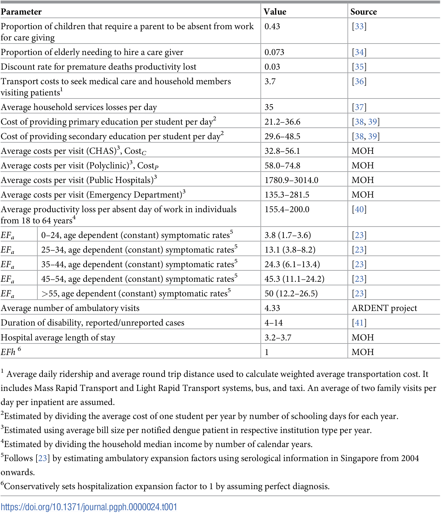
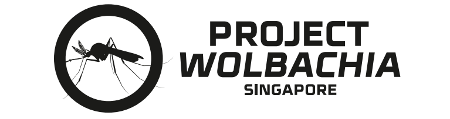

#  Project 4 - Prediction of Dengue Cases

## Background

Dengue fever is a disease caused by the dengue virus and is a vector-borne disease whereby the virus is transmitted to human via the bite of an infected female _Aedes aegypti_ mosquito. The Aedes mosquito prefers to breed after rainy days where there are many pools of stagnant water. They also prefer the warm climate such as Singapore where it facilitates faster multiplication of the mosquito [(Reference)](https://www.nea.gov.sg/media/news/news/index/nea-urges-continued-vigilance-as-aedes-aegypti-mosquito-population-and-number-of-dengue-cases-remain-high-at-the-start-of-2020#:~:text=Climate%20change%20is%20anticipated%20to,the%20chances%20of%20dengue%20transmission.)

Once a person is bitten by an infected Aedes mosquito, there is an incubation period of between 4 to 7 days (ranges from 3 to 14 days)before a person displays symptoms of dengue fever which are sudden onset of fever, joint and muscle pain and skin rashes.  [(Reference)](https://www.moh.gov.sg/diseases-updates/dengue). 

Although dengue does not spread from person to person, the implications of dengue fever to the individual in terms of time off work and lost of productivity have an impact on healthcare burden and economic consequences. Time off work is also applicable to caregiver who may have to take time off to look after the infected individual. According to paper published in 2021 by Soh et. al, the average estimated economic impact of dengue in Singapore from 2010 to 2020 is approximately \\$1.014 to $2.265billion [(Reference)](https://www.ncbi.nlm.nih.gov/pmc/articles/PMC10021432/#:~:text=We%20estimated%20that%20the%20average,21%2C262%20DALYs%20from%202010%E2%80%932020). 

In order to mitigate the economic cost of dengue fever, the National Environment Agency (NEA) has initiated several campaigns for dengue prevention programs. These initiatives include public awareness campaigns, community engagement efforts, and mosquito control measures. Despite these efforts, dengue outbreaks continue to pose a significant challenge to public health, burdening the healthcare system and affecting the quality of life for residents.

___
## Problem Statement 

The effectiveness of dengue prevention programs in Singapore is a critical concern for the National Environmental Agency. To this end, we will be **using machine learning models to predict the cases of dengue fever in Singapore using historical climate and google search trends.** Using metrics from the optimal modeling process, we will perform cost benefit analysis of dengue prevention program. This approach allows for evidence-based decision-making and optimization of resource allocation for public health initiatives.
___
## Dataset

We retrieved our data from:
| # | Dataset                                    | Source                                                             |
|---|--------------------------------------------|--------------------------------------------------------------------|
| 1 | Dengue Data                                | data.gov API                                                       | 
| 2 | Weather Data                               | Meteorological Service Singapore Website: Historical Daily Records | 
| 3 | Google Search Terms                        | Google Trends Search: via PyTrends                                 | 


___
## Evaluation of Models
Based on the models that we ran, we can say that most of the models did not perform well. It is clear that prediction even in the short term would be difficult due to the variable nature of dengue cases. Because the two spikes of dengue cases at the end have not happened before, it was very difficult for our models to predict them, especially if we do not include exogenous variables.

However, our SARIMAX model which takes both weather data and Google search trends into account performed reasonably well. The overall results are as follows:

| # | Model Type                                    | MAPE                        | MAE                           | RMSE                          | Review                       | Choose model? |
|---|-----------------------------------------------|-----------------------------|-------------------------------|-------------------------------|------------------------------|---------------|
| 1 | ARIMA                                         | Train: 0.175<br>Test: 0.414 | Train: 34.922<br>Test: 55.026 | Train: 55.116<br>Test: 61.699 | Poor MAPE, overfit.          |               |
| 2 | SARIMA                                        | Train: 0.178<br>Test: 0.442 | Train: 34.960<br>Test: 58.870 | Train: 54.974<br>Test: 66.402 | Did not improve on baseline. |               |
| 3 | SARIMAX (Weather Data)                        | Train:0.183<br>Test: 0.463  | Train:36.571<br>Test: 62.178  | Train:57.988<br>Test: 62.426  | Did not improve on baseline. |               |
| 4 | SARIMAX (Google Search Trends)                | Train: 0.160<br>Test: 0.424 | Train:33.740<br>Test: 56.829  | Train: 52.956<br>Test: 62.334 | Did not improve on baseline. |               |
| 5 | SARIMAX (Weather Data + Google Search Trends) | Train: 0.162<br>Test: 0.279 | Train:33.833<br>Test: 37.760  | Train: 53.142<br>Test: 39.878 | Improved MAPE.               | ✓             |

___
## Cost-Benefit Analysis

<p style="text-align: justify;">This section will address the cost-benefit analysis (CBA) of dengue prevention programs in Singapore. The purpose of is to compare the total costs of involved in a project with its anticipated benefits. With respect to this, we aim to perform a cost benefit analysis of Project Wolbachia in Singapore and advertisement cost of dengue prevention in Singapore versus its benefit of reducing incidence of dengue fever in Singapore. Data from reliable journals and previous newspaper will be referenced.
</p>

### Economic Cost of Dengue Fever on Singapore's Economy

<p style="text-align: justify;">
    Soh et. al. estimated the economic cost of dengue on Singapore's economy from 2010 to 2020 to be between SGD 1.382 billion to SGD 3.086 billion. This amounts to approximately SGD 223.4million per month.     
    <a href="https://journals.plos.org/globalpublichealth/article?id=10.1371/journal.pgph.0000024#references">(Reference).</a>


The economic cost was divided into direct medical and indirect costs. 

<p style="text-align: justify;">Direct medical costs refer to expenses associated with medical treatment for the individual. However, in the broader context for cost to the nation's economy, direct medical cost incurred by a dengue fever patient refers to subsidies provided by the government to offset the total medical cost that would be chargebale to the patient. Examples of such costs, include Medisave claims, Community Health Assist Scheme (CHAS) subsidy for consultation, subsidy on hospitalisation, treatment, investigations and subsequent follow-up visits etc... </p>

<p style="text-align: justify;">Indirect medical costs the financial effect of illness or medical conditions that goes beyond direct medical costs. Examples of indirect medical costs include absenteeism, productivity loss and caregiver time etc.. These will impact the overall economic productivity. </p>

The table below details the economic cost as noted in the paper by Soh et. al.

<div>
<center><center>
</div>

### Dengue Prevention Programs 

Over the past few decades, dengue prevention programs has evolved to incorporate new technologies to prevent dengue infection. The widely known dengue prevention project currently in  large scale deployment is the "Project Wolbachia" program. This is also known as the incompatible insect technique (IIT) whereby male _Aedes_ mosquitoes infected with the Wolbachia bacteria is released to breed with the wild-type female _Aedes aegypti_ mosquito to yield non-viable eggs, thereby reducing the number of _Aedes_ mosquitoes in the community. The project has been shown to lower the population _Aedes_ mosquitoes by up to 98% as well as reducing the number of dengue fever cases by up to 88% [(Reference)](https://www.medrxiv.org/content/10.1101/2021.06.16.21257922v1). Currently the project is being conducted in 13 estates around Singapore which coverage of nearly 300,000 households by the Housing Develoment Board (HDB) flats[(Reference)](https://www.nea.gov.sg/corporate-functions/resources/research/wolbachia-aedes-mosquito-suppression-strategy/wolbachia-aedes-release-schedule). It was estimated by Soh et. al that to reach a steady state of covering the entire Singapore, project Wolbachia would cost the economy around SGD 40,000,000 per year which would be approximately SGD3.33 million per month. 

<div>
<center><center>
</div>

<p style="text-align: justify;">Based on the modeling metrics for predicting the dengue cases, we can propose a more targeted approach towards dengue prevention. Our best model currently is able to predict 3 months in advance with an estimated mean error of 27.85%. 

There are a few assumption for the purpose of benefit-cost analysis: 
- Reduction in economic in direct proportion to reduction in dengue fever cases.
- Efficacy of project Wolbachia to reduce dengue fever cases by 80%. 
  - Project runs for the entire year. 
- Reduction from Wolbachia project will have a lag period of 1 month based on the life cycle of the mosquitoes

**Baseline Benefit**

*Baseline benefit cost ratio:* 
```math
Economic cost * efficacy of project Wolbachia  / steady state cost of project Wolbachia
= 223.4mil * 0.80 / 40mil = 4.468
```

*Economic impact reduction from project Wolbachia based on model prediction:*
```math
= 223.4mil * 0.8 * (1- MAPE) = SGD 128.95mil 
```

We will use 2 scenarios, the maximum hypothetical benefit and minimum hypothetical benefit.

**Minimum Hypothetical Benefit**

_For minimum hypothetical benefit-cost ratio, we are assuming there is one peak in our 3month ahead prediction, therefore we will be deploying project Wolbachia 4 months in a year._

*Cost of 4 months of deploying Wolbachia mosquitoes:* SGD 13.32mil 

*Hypothetical minimum benefit cost ratio:*

```math
128.95 mil/13.32 mil = 9.681 (2.2 times improvement from baseline)
```

**Maximum Hypothetical Benefit**

_For maximum hypothetical benefit-cost ratio, we are assuming there is one peak for the entire year based on our prediction, therefore we will be deploying project Wolbachia 1 month in a year._

*Cost of 1 month of deploying Wolbachia mosquitoes*: SGD 3.33mil 

*Hypothetical maximum benefit-cost ratio:*
```math
128.95 mil / 3.33 = 38.724 (8.7 times improvement from baseline!)
```
___
## Conclusion and Recommendations

Based on our models, the best forecasting algorithm which would yield the lowest MAPE will be the SARIMAX model. However due to the different peaks and troughs, coupled with lack of seasonality within the year, we recommend a prediction model to just forecast 3 months ahead to account for the breeding cycle of the *Aedes* mosquitoes as well as to maximize the efficacy of Project Wolbachia. Based on our modeling, the benefit-cost analysis shows a definite improvement compared to baseline.
However, there is definitely room for improvement to augment the performance of our predictive model.

A few recommendations include:
1. Gathering more data such as daily dengue cases to further augment our dataset.
2. Continuously running the model to gather more data and fine-tune the hyperparameters to optimize the model. The objective is to progressively increase the period of projection up to 1 year to align with annual budget cycle of NEA.
3. By gathering more data, we hope to run more complex models to ascertain if a better predictive model can be sought. An example will be using time-series neural networks such as long short-term memory networks (LSTM), or a more robust time-series model such as the Prophet library.

